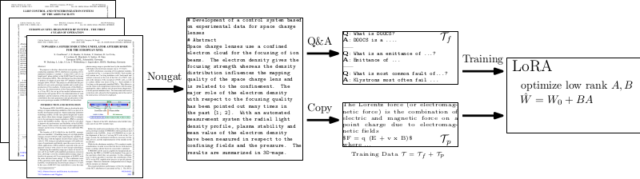

# PACuna : Automated Fine-Tuning of Language Models for Particle Accelerators
Sources are in sources folder. Unforutnately, some training sources (books) are licensed, therefore neither source data nor model can be published. 

[pdf](NeurIPS_2023_LLM.pdf) [arxiv](https://arxiv.org/abs/2310.19106)

.

Navigating the landscape of particle accelerators has become increasingly challenging with recent surges in contributions. These intricate devices challenge comprehension, even within individual facilities.
To address this, we introduce PACuna, a fine-tuned language model refined through publicly available accelerator resources like conferences, pre-prints, and books.
We automated data collection and question generation to minimize expert involvement and make the data publicly available.
PACuna demonstrates proficiency in addressing intricate accelerator questions, validated by experts.
Our approach shows adapting language models to scientific domains by fine-tuning technical texts and auto-generated corpora capturing the latest developments can further produce pre-trained models to answer some intricate questions that commercially available assistants cannot and can serve as intelligent assistants for individual facilities.


# Code
Each LLM need a proper prompt to know that we are asking a question:
```python
def prompt_formatter(question, answer = ""):
    return f'### Human:\n{question}\n### Assistant:\n{answer}'
```

### PDF to Markdown
To transform PDF to MMD, we use nougat OCR (https://github.com/facebookresearch/nougat)
```bash
nougat *.pdf -o .
```
In publication we mistakenly omitted  --no-skipping, we suggest others to use this parameter 

### Preprocessing
Considering Nougat OCR MultipleMarkdown, which expresses equations with \(\), \[\] and tables, we prefer to have them in standardized format where equations are expressed in $, $$ and tables in plaintext 
```python
    # replace \[.*\] with equation mode $$
    eq_expr = re.compile(r'\\\[(.*?)\\\]', flags = re.DOTALL)
    while len(re.findall(eq_expr, x)) != 0:
        eq_re = re.search(eq_expr,x)
        x = x[:eq_re.start()] + '$$' + x[eq_re.start() + 2 :eq_re.end()-2] + '$$' + x[eq_re.end():]

    # replace inline math \(.*\) with $ $
    eq_expr = re.compile(r'\\\((.*?)\\\)', flags = re.DOTALL)
    while len(re.findall(eq_expr, x)) != 0:
        eq_re = re.search(eq_expr,x)
        x = x[:eq_re.start()] + '$' + x[eq_re.start() + 2 :eq_re.end()-2] + '$' + x[eq_re.end():]
        
    # replace tables
    tabular_expr = tag_expr_full('table')
    while len(re.findall(tabular_expr,x)):
        tabular_re = re.search(tabular_expr,x)
        try:
            tabular_plain = pypandoc.convert_text(tabular_re.group(), 'markdown',format = 'latex', extra_args=['--wrap=none'])
        except Exception as e:
            tabular_plain = ""
            # print(f'EXCEPTION {str(e)} {tabular_re.group()}')
        x = x.replace(tabular_re.group(), tabular_plain)
```

At this stage, we have unsupervised data prepared

### Supservised Data (Q&A Paris)
To generate Q&A pairs, we ask vicuna1.5-16k model with a following prompt
```python
query = prompt_formatter(f"Generate ten questions with answers for paper:\"{data_}\"")
```
where data_ contains paper itself. 

To generate text from LLM, we use following text block (maxl
```python
def test(q, model, max_length=16384, temperature=0.6):
    inputs = tokenizer(q, return_tensors="pt", return_token_type_ids=False).to(device)
    outputs = model.generate(
        **inputs,
        max_length=max_length,
        # repetition_penalty=1.18,
        eos_token_id=tokenizer.eos_token_id,
        do_sample=True,
        top_p=1.0,  # top_k=64,
        temperature=temperature,
    )
    answer = tokenizer.decode(outputs[0], skip_special_tokens=True)
    # print(f">{answer}\n---------")
    return answer
```

In order to extract Q&A invidual pairs, we use following heuristics
```python
def extract_qa_pairs_from_result(text):
    qa_pairs = []
    text = re.split(r'\d+\.\s(.*\?)\n(.*)',text)
    text = [t for t in text if not t.isspace() and len(t) > 0]
    if len(text) % 2 == 0:
        for i in range(0,len(text),2):
            q = text[i]
            a = re.sub(r'^Answer:', '', text[i+1])
            qa_pairs.append({'question' :  q,
                           'answer' : a})
    return qa_pairs
```

### Fine-tuning LLM
See [lora_unsup.ipynb](lora_unsup.ipynb)

### Test
```python
    peft_model_id = model_folder + "/human_assistant_prompt_all_papers/checkpoint-77100/" # Last Checkpoint Path
    
    # peft_model_id = model_folder + "/checkpoint-13200/"
    config = PeftConfig.from_pretrained(peft_model_id)
    model = AutoModelForCausalLM.from_pretrained(
        config.base_model_name_or_path,
        torch_dtype="auto",
        device_map="auto",
        offload_folder="offload",
        offload_state_dict=True,
    )  
    tokenizer = AutoTokenizer.from_pretrained(config.base_model_name_or_path)
    model = PeftModel.from_pretrained(model, peft_model_id)
    # model = model.merge_and_unload()
```

Querying LLM
```python
device = 'cuda'
max_length = 256
T = 0.7

p = "What is klystron"
test(prompt_formatter(p), model, tokenizer, max_length = max_length, temperature = T) 
```
